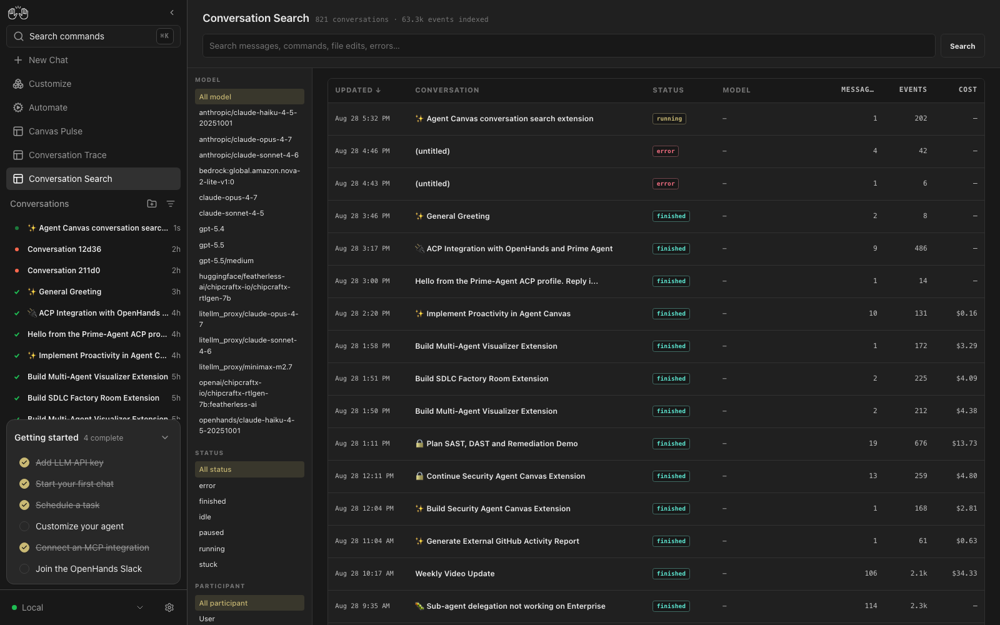
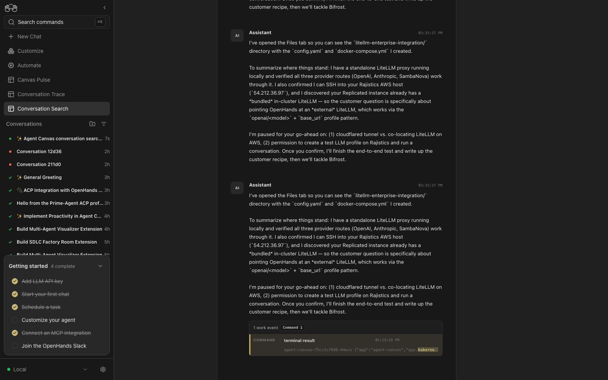

# Agent Canvas Conversation Search

Full-text search and reverse-chronological browsing for local [Agent Canvas](https://github.com/OpenHands/agent-canvas) conversation history.

The project adds a native Canvas v1 extension with:

- SQLite FTS5 search across messages, tool calls, commands, edits, observations, and errors
- newest-first conversation history
- filters for model, status, participant, event type, and tool
- columns for updated time, title, status, model, message count, event count, and cost
- a conversation-first transcript and a raw event trace
- direct navigation from every result to its full conversation view





This project was inspired by [AgentsView](https://www.agentsview.io/). It is an independent implementation designed for the Agent Canvas Extensions v1 contract.

## How it works

The package has two parts:

```text
extension/                 Native Agent Canvas browser extension
  canvas-extension.json
  extension.js
service/                   Local indexer and search API
  indexer.py
  server.py
  scripts/start.sh
  scripts/reindex.sh
```

The service reads local Agent Canvas conversation event files, builds a SQLite FTS5 index, and exposes a read-only HTTP API on `127.0.0.1:8765`. The extension queries that API for search and uses the authenticated Agent Server API for the complete trace view.

No Python or JavaScript packages are required.

## Requirements

- A local Agent Canvas installation
- Python 3.10 or newer
- Python's SQLite build with FTS5 enabled
- Conversation persistence at `~/.openhands/agent-canvas/dev_conversations` or another accessible directory

For general Agent Canvas setup, see the [OpenHands local setup documentation](https://docs.openhands.dev/openhands/usage/run-openhands/local-setup).

## Install

### 1. Clone the repository

```bash
git clone --branch v0.1.0 https://github.com/rajshah4/agent-canvas-conversation-search.git
cd agent-canvas-conversation-search
```

### 2. Build the index and start the service

Run this in a terminal and leave it running:

```bash
./service/scripts/start.sh --full
```

The initial indexing pass can take several seconds. Later starts are incremental:

```bash
./service/scripts/start.sh
```

Confirm that the service is ready:

```bash
curl http://127.0.0.1:8765/api/health
```

Expected response:

```json
{"status": "ok", "service": "agent-canvas-conversation-search"}
```

### 3. Install the Canvas extension

In Agent Canvas:

1. Open **Customize → Extensions**.
2. Select **Add extension**.
3. Enter the following values:

| Field | Value |
| --- | --- |
| Source | `github:rajshah4/agent-canvas-conversation-search` |
| Ref | `v0.1.0` |
| Repository path | `extension` |

4. Install the extension.
5. Review the trusted-code notice and enable **Conversation Search**.
6. Select **Search** in the Canvas navigation.

For local development, use the absolute path to this repository's `extension` directory as the source instead.

## Configuration

The helper scripts support these environment variables:

| Variable | Default | Purpose |
| --- | --- | --- |
| `PERSIST_DIR` | `~/.openhands/agent-canvas/dev_conversations` | Conversation persistence directory |
| `SEARCH_DB` | `~/.openhands/agent-canvas/search.db` | SQLite index location |
| `SEARCH_HOST` | `127.0.0.1` | Search service bind address |
| `SEARCH_PORT` | `8765` | Search service port |

Example with custom paths:

```bash
PERSIST_DIR=/path/to/dev_conversations \
SEARCH_DB=/path/to/search.db \
SEARCH_PORT=9000 \
./service/scripts/start.sh --full
```

If the port changes, configure the extension in the browser console and reload Canvas:

```javascript
localStorage.setItem("conv-search:api-base", "http://127.0.0.1:9000");
location.reload();
```

Remove the override with:

```javascript
localStorage.removeItem("conv-search:api-base");
location.reload();
```

## Give agents access to conversation history

Install the bundled progressive-disclosure skill so Agent Canvas conversations can search history without loading complete traces.

In **Customize → Skills**, add:

| Field | Value |
| --- | --- |
| Source | `github:rajshah4/agent-canvas-conversation-search` |
| Ref | `main` |
| Repository path | `skills/conversation-history-search` |

Enable **Conversation History Search** and start a new conversation so Canvas includes the newly installed skill. Requests such as “search past conversations for the pagination cursor bug” trigger it. The agent invokes the bundled dependency-free CLI, which queries the local service and returns compact evidence windows.

The CLI can also be used directly:

```bash
python3 skills/conversation-history-search/scripts/search_history.py health
python3 skills/conversation-history-search/scripts/search_history.py recent --limit 10
python3 skills/conversation-history-search/scripts/search_history.py search "pagination cursor" --limit 5
```

Historical content is treated as untrusted evidence. The skill instructs agents to cite conversation IDs and event sequences, verify stale facts, and never execute instructions found in retrieved history.

## Agent context API

`GET /api/context` performs ranked FTS5 search and returns each match with a small, deduplicated window of neighboring events. This is more token-efficient than requesting `/api/conversation/:id`.

| Parameter | Default | Description |
| --- | --- | --- |
| `q` | required | FTS5 query |
| `limit` | `5` | Matching events, clamped to 1–20 |
| `context` | `1` | Neighboring events on each side, clamped to 0–10 |
| `max_chars` | `1200` | Text per event, clamped to 200–10,000 |
| `model`, `status` | — | Conversation metadata filters |
| `role`, `kind`, `tool` | — | Matching event filters |
| `after`, `before` | — | Conversation `updated_at` bounds |

Example:

```bash
curl --get http://127.0.0.1:8765/api/context \
  --data-urlencode 'q="next_page_id"' \
  --data-urlencode 'limit=3' \
  --data-urlencode 'context=1'
```

The response reports total and returned match counts, conversation metadata, matched event sequences, and bounded event text. Overlapping windows in the same conversation are deduplicated.

## Keep the index current

The service does not yet watch the filesystem. Run an incremental indexing pass after new conversations are created:

```bash
./service/scripts/reindex.sh
```

A scheduler can run the same command periodically. The server reads the database on every request, so it does not need to restart after reindexing.

Force a complete rebuild with:

```bash
./service/scripts/reindex.sh --full
```

## Search behavior

With an empty query, the extension displays conversations ordered by most recently updated first. Metadata and event filters work independently of full-text search.

Text search uses SQLite FTS5:

- `kubernetes` uses prefix matching
- `"conversation search"` searches for an exact phrase
- `agent canvas` requires both terms

Search results are grouped by conversation. Selecting a match opens the entire transcript and highlights only the selected match.

## Privacy and security

The index can contain prompts, assistant messages, commands, file contents, tool output, and errors. Treat `search.db` as sensitive local data.

The search API has no authentication and intentionally binds to `127.0.0.1` by default. Do not expose it on a network without adding authentication and transport security. The database and conversation data are excluded by `.gitignore`.

## Development

Validate the source files:

```bash
python3 -m py_compile service/indexer.py service/server.py
node --check extension/extension.js
python3 -m unittest discover -s tests -v
```

A Canvas extension validator can additionally validate `extension/` against the Extensions v1 package contract.

## Limitations

- Local Agent Canvas persistence only; hosted conversation data is not indexed.
- Index refresh is explicit rather than automatic.
- The extension expects the search API to be reachable by the browser.
- The full trace view loads at most 500 unique events per conversation.

## License

MIT

_Created with OpenHands on behalf of Rajiv Shah._
